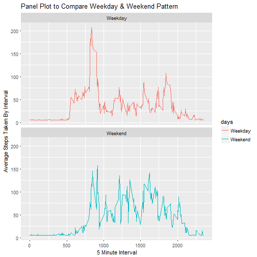

#Reproducable Research Week 2 Peer Graded Assignment Project
Author:Kaushik Bardhan
Date: February 26, 2017


This R Markdown file contains all the steps and respective R code required for the assignment. Activity Monitoring Data is provided for this assignment which is used in this code.

##First step is to load all the necessary packages required to generate the Markdown document
======================================================================================================


```r
library(plyr)
library(dplyr)
library(ggplot2)
```

## Code for reading in the dataset and/or processing the data
==============================================================
As we start on the assignment, the first step is to load the data and I used the read.csv command to read the data from the current working directory. Then I processed the data so that the information is readily available for the following steps.
N= Total number of non-NULL records for each date
total = Sum of all steps during the day
mean = Average steps taken each day
median = Median Steps taken each day


```r
activity <- read.csv("activity.csv")

cact <- ddply(activity, c("date"), summarise,
               N    = sum(!is.na(steps)),
               total = sum(steps, na.rm=TRUE),
               mean = mean(steps, na.rm=TRUE),
               median   = median(steps, na.rm=TRUE)
)
```
##Histogram of the total number of steps taken each day
=======================================================
Then I generate the Histogram to show the frequency distribution of total number of steps per day. That is followed by 


```r
hist(cact$total, xlab = "Total # of Steps Per Day", main = "Histogram of Frequency of Steps per Day")
```


## Mean and median number of steps taken each day
=================================================
As instructed I then calculate the Mean and Median number of Steps taken each day from the previous step


```r
mean(na.omit(cact$total))
```

```
## [1] 9354.23
```

```r
median(na.omit(cact$total))
```

```
## [1] 10395
```
##Time series plot of the average number of steps taken
=======================================================


```r
plot(cact$date,cact$mean, xy.lines=TRUE, xy.labels=TRUE, main="Time Series Plot of Average Steps taken per day",ylab="Average Steps",xlab="Date", panel=lines)
```


## The 5-minute interval that, on average, contains the maximum number of steps
================================================================================
First I show a graph plotting the average number of steps taken at each 5 minute interval so that it is clear at what interval it is highest and then the find out the exact time interval.


```r
max_int <- ddply(activity, c("interval"), summarise,
               avg_steps = mean(steps, na.rm=TRUE),
               median_steps   = median(steps, na.rm=TRUE)
)

ggplot(max_int, aes(interval,avg_steps)) +geom_line() +ggtitle("Plot of Average Steps per Interval") + ylab("Average Steps Taken") +xlab("5 Minute Interval")
```


```r
max_int_ord <- arrange(max_int,desc(avg_steps))
max_int_ord[1,1]
```

```
## [1] 835
```

## Code to describe and show a strategy for imputing missing data
=================================================================
First I create a separate dataset of missing data and then find out the number of days will missing values by dividing total number of missing(NA) records of Steps by to total count of intervals calculated by "N" above.

After that I substitute all missing values with the Avg number of steps taken of all 5 minute interval. At this point the original dataset is updated with no more missing data.


```r
miss_days <- is.na(activity$steps)
sum(miss_days)/median(cact$N)
```

```
## [1] 8
```

```r
for(i in 1:ncol(activity)){
  activity[is.na(activity[,i]), i] <- mean(activity[,i], na.rm = TRUE)
}
```

```
## Warning in mean.default(activity[, i], na.rm = TRUE): argument is not
## numeric or logical: returning NA
```

```r
nomiss_act <- ddply(activity, c("date"), summarise,
               N    = sum(!is.na(steps)),
               total = sum(steps, na.rm=TRUE),
               mean = mean(steps, na.rm=TRUE),
               median   = median(steps, na.rm=TRUE)
)
```
## Histogram of the total number of steps taken each day after missing values are imputed
==========================================================================================
Below is the Histogram of the updated dataset and the distribution shows the increased number of occurances of the average number of steps. Mean and Median also shows higher values than earlier.


```r
hist(nomiss_act$total, xlab = "Steps Per Day", main = "Histogram of Steps per Day after Imputing Missing Data")
```


```r
mean(na.omit(nomiss_act$total))
```

```
## [1] 10766.19
```

```r
median(na.omit(nomiss_act$total))
```

```
## [1] 10766.19
```


##Panel plot comparing the average number of steps taken per 5-minute interval across weekdays and weekends
==================================================================================================================
Below piece of code separates thelatest dataset to Weekdays and Weekends based on the dates in the data. "weekdays" function is used after converting the factor to Date.

Once the segregation is done I have used the cbind function to attach the daytype variable to the original dataset.

A Panelplot is then generated to show the behavioral differences between weekdays a Weekends.


```r
onlydates<- as.Date(activity$date)
days<-weekdays(onlydates)
x <- c("Saturday" , "Sunday")
y <- c("Monday" , "Tuesday","Wednesday","Thursday", "Friday")
days<-ifelse(grepl(paste(x, collapse = "|"), days), "Weekend", days)
days<-ifelse(grepl(paste(y, collapse = "|"), days), "Weekday", days)
days<- as.factor(days)
weekdata<-cbind(activity,days)
stepsbydaytype <- ddply(weekdata, c("days","interval"), summarise,
               new_avg_steps = mean(steps),
               new_median_steps   = median(steps)
)

ggplot(stepsbydaytype, aes(x=interval, y=new_avg_steps, color = days)) + geom_line() + facet_wrap(~days, ncol = 1, nrow=2) + ggtitle("Panel Plot to Compare Weekday & Weekend Pattern")+ylab("Average Steps Taken By Interval") +xlab("5 Minute Interval")
```



We can clearly notice that the Weekday activities start early but does not go very high over the day. However the weekends show steady activity throughout the day. 
